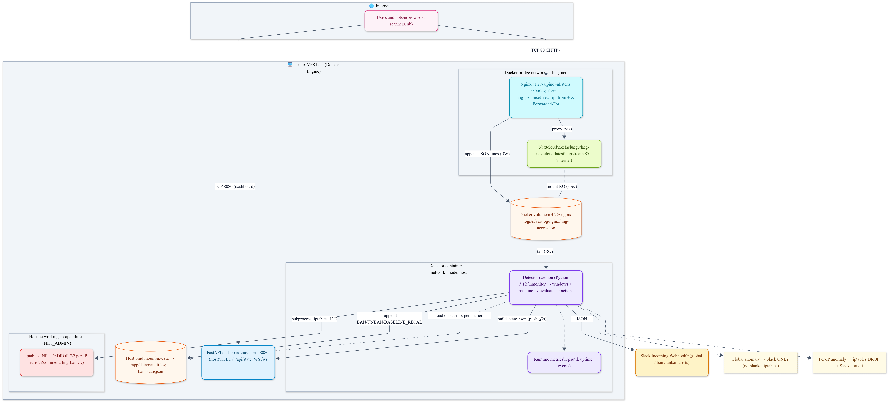

# HNG anomaly detector (cloud.ng)

Real-time HTTP anomaly detection for a **Nextcloud** stack: tail **Nginx JSON access logs**, compare short-window request rates to a **rolling 30‑minute baseline**, then optionally **alert on Slack**, **iptables DROP** abusive IPv4s with **tiered auto-unban**, and expose a **live metrics dashboard**.

The upstream Nextcloud image is **not modified** ([`kefaslungu/hng-nextcloud`](https://hub.docker.com/r/kefaslungu/hng-nextcloud)). All detection logic lives in **`detector/`**.

**Public repository:** `https://github.com/Trojanhorse7/hng-anomaly-detector`

**Live endpoints:**

| What | URL |
|------|-----|
| VPS public IPv4 | `MY_VPS_IP` |
| Nextcloud (via Nginx) | `http://MY_VPS_IP/` |
| Metrics dashboard (FastAPI) | `http://MY_VPS_IP:8080/` |
| Metrics on a hostname (recommended) | `http://trojan0.duckdns.org/` _(DNS + reverse proxy — see docs)_ |

---

## Why Python

The daemon is implemented in **Python 3.12** because it keeps IO (log tail), statistics (baseline mean/std over per‑second buckets), concurrency (threads), and HTTP (dashboard) in one codebase with readable control flow and **no hand-rolled deque/baseline** substitutions. Dependencies stay small (**PyYAML**, **psutil**, **FastAPI**, **uvicorn**); **`iptables`** is invoked via subprocess. Fail2Ban and third-party rate‑limiting primitives are intentionally not used, per brief.

---

## Sliding window (60 seconds)

[`detector/windows.py`](detector/windows.py) maintains:

- **`collections.deque`** timestamps for **all requests** (global) and **per `source_ip`**.
- Parallel deques for **4xx/5xx** hits (error surge path).

On each line, new timestamps are **appended**; anything older than **`now − window_seconds`** (default **60**) is **popped from the left** after pruning. **RPS** is **count ÷ 60** for global and per IP. There is **no** “one counter per minute” shortcut; eviction is continuous over the last full minute. Optional **sweep** removes empty per-IP deques to cap memory.

---

## Rolling baseline (30 minutes)

[`detector/baseline.py`](detector/baseline.py) increments **per-second** global totals (and error totals) as lines arrive. Every **`baseline_recompute_interval_seconds`** (default **60**), it builds dense **30‑minute** vectors (`baseline_window_seconds`, default **1800**), then:

- Prefers **seconds in the current UTC hour** when there are at least **`baseline_min_samples_current_hour`** samples; otherwise uses the **full window**.
- Computes **sample mean** and **sample stddev** of per-second rates; separate stats for **errors** (for surge detection).
- Applies **floors**: **`baseline_floor_rps`** on mean, **`baseline_min_std`** on std (avoids divide-by-zero in z-scores).

**Not hardcoded:** `effective_mean` / `effective_std` always come from this recompute. Baseline and ban/unban events are **audited** to `audit_log_path` (see config).

---

## Detection (summary)

[`detector/detector.py`](detector/detector.py) compares **current RPS** (from sliding windows) to the latest baseline. A **global** or **per-IP** hit is raised if **either**:

- **z-score** \> configured threshold (default **3.0**, or **2.0** when “error surge” tightens), **or**
- **rate** \> **`rate_multiplier` × baseline mean** (default **5×**, or **3×** when tightened).

**Error surge:** if an IP’s error RPS exceeds **`error_surge_multiplier` × baseline error mean** (default **3×**, with a small floor to ignore noise), thresholds tighten for that evaluation path.

**Actions:** global anomaly → **Slack only**. Per-IP anomaly → **iptables DROP** + Slack + audit, with **10 m / 30 m / 2 h** then **permanent** tiering in [`detector/unbanner.py`](detector/unbanner.py).

---

## Setup from a fresh Linux VPS

**Assumptions:** Ubuntu/Debian-like, **2 vCPU / 2 GB RAM** minimum, **public IPv4**, security group allows **TCP 22**, **80**, and **8080** (or restrict **8080** and proxy the dashboard on **443**).

### 1. Install Docker Engine + Compose plugin

Follow [Docker’s install docs](https://docs.docker.com/engine/install/) for your distro, then verify:

```bash
docker --version
docker compose version
```

### 2. Clone and configure

```bash
git clone https://github.com/Trojanhorse7/hng-anomaly-detector
cd hng-anomaly-detector
cp .env.example .env
```

Edit **`.env`** and set **`SLACK_WEBHOOK_URL`** to your [Slack Incoming Webhook](https://api.slack.com/messaging/webhooks). Optional: tune [`detector/config.yaml`](detector/config.yaml) (thresholds, paths, dashboard port).

### 3. Data directory

The compose file mounts **`./data`** → **`/app/data`** for **audit log** and **ban state**. Ensure the folder exists (a **`.gitkeep`** may already be there).

### 4. Start the stack

```bash
# build image
docker compose build

# Bring up images
docker compose up -d

# tail detector logs
docker compose logs -f detector
```

- **Nextcloud** is reached at **`http://<VPS_IP>/`** (Nginx on port **80**).
- **Detector** uses **`network_mode: host`** and **`NET_ADMIN`** so **iptables** applies to the **host** (Linux VPS). The **metrics UI** defaults to **`http://<VPS_IP>:8080/`**.

On **Docker Desktop (Windows/macOS)**, host networking behaves differently; use a **Linux VPS** for production-like **iptables** and ports.

### 5. Slack and config

Webhook resolution: environment **`SLACK_WEBHOOK_URL`** wins; otherwise **`slack.webhook_url`** in YAML (supports **`${SLACK_WEBHOOK_URL}`** expansion after load — see [`detector/env_expand.py`](detector/env_expand.py)).

---

## Repository layout (brief)

| Path | Role |
|------|------|
| [`detector/main.py`](detector/main.py) | Entrypoint, wiring, `on_event` |
| [`detector/monitor.py`](detector/monitor.py) | Tail + JSON parse |
| [`detector/windows.py`](detector/windows.py) | 60 s deques |
| [`detector/baseline.py`](detector/baseline.py) | 30 m rolling baseline |
| [`detector/detector.py`](detector/detector.py) | z-score + rate rules |
| [`detector/actions.py`](detector/actions.py) | Slack + `BanManager` |
| [`detector/blocker.py`](detector/blocker.py) | iptables |
| [`detector/unbanner.py`](detector/unbanner.py) | Tiers + persistence + unban thread |
| [`detector/notifier.py`](detector/notifier.py) | Slack webhook client |
| [`detector/dashboard.py`](detector/dashboard.py) | FastAPI + WebSocket + `/api/state` |
| [`detector/config.yaml`](detector/config.yaml) | Thresholds and paths |
| [`nginx/nginx.conf`](nginx/nginx.conf) | JSON log, `X-Forwarded-For`, proxy to Nextcloud |
| [`docker-compose.yml`](docker-compose.yml) | Stack + **`HNG-nginx-logs`** volume |

---

## Architecture & flow diagrams

**Main architecture (PNG):** [`docs/diagrams/architecture.png`](docs/diagrams/architecture.png)



**Other exported image:**

- [`docs/diagrams/flowDiagram.png`](docs/diagrams/flowDiagram.png) — sequence flow from one HTTP request to anomaly decision and reaction (global vs per-IP, ban tiers, audit, dashboard push).


## Screenshots (submission evidence)

Captured under [`screenshots/`](screenshots/):

| Screenshot | Description |
|------------|-------------|
| [`Tool-running.png`](screenshots/Tool-running.png) | Daemon running, processing log lines |
| [`Ban-slack.png`](screenshots/Ban-slack.png) | Slack ban notification |
| [`Unban-slack.png`](screenshots/Unban-slack.png) | Slack unban notification |
| [`Global-alert-slack.png`](screenshots/Global-alert-slack.png) | Slack global anomaly notification |
| [`Iptables-banned.png`](screenshots/Iptables-banned.png) | `sudo iptables -L INPUT -n -v --line-numbers` showing a blocked IP (DROP) |
| [`Audit-log.png`](screenshots/Audit-log.png) | Structured audit log: ban, unban, `BASELINE_RECALC` |
| [`Baseline-graph.png`](screenshots/Baseline-graph.png) | Baseline over time: ≥ two hourly slots, different `effective_mean` |

---

## Blog post
Link: [`BLOG URL`](https://dev.to/trojanhorse7/building-a-rolling-baseline-http-anomaly-detector-no-fail2ban-4kf2)

---

## License / compliance

Built for the **HNG DevOps / DevSecOps** track. Do not use **Fail2Ban** for the detection path; thresholds stay in **config**, not hardcoded means.
